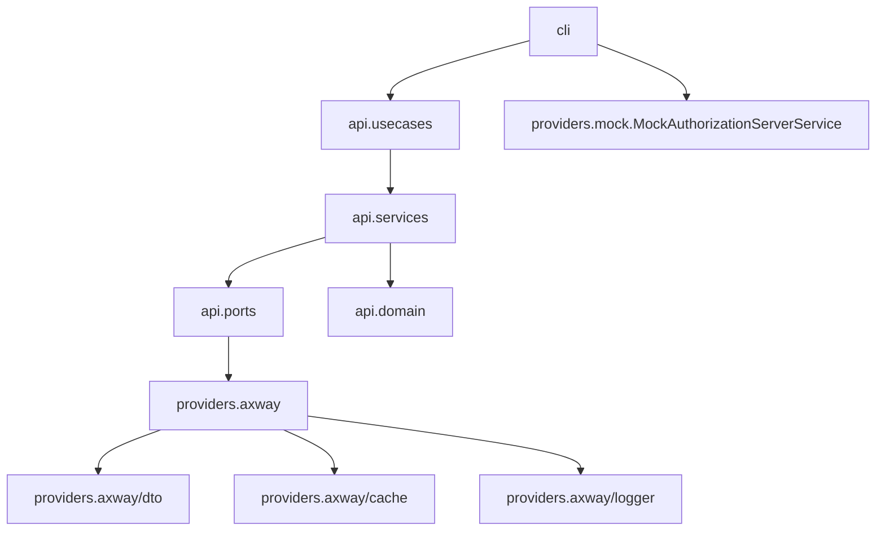
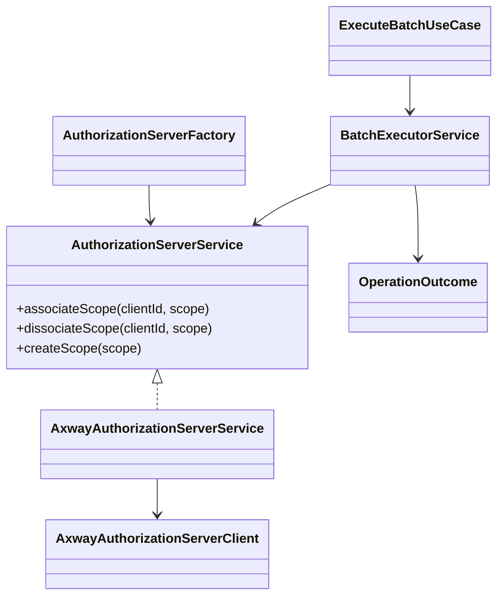

# 2. Arquitetura

[Anterior](overview.md) | [Índice](README.md) | [Próximo](configuration.md)

## Diagrama de Módulos

## Diagrama de Classes

## Camadas
- **cli**: ponto de entrada e interação com usuário/ambiente (`com.company.scopehandler.cli`).
- **api.usecases**: orquestração principal do batch.
- **api.services**: regras de execução, paralelismo e auditoria.
- **api.ports**: contratos de integração (ex.: `AuthorizationServerService`).
- **providers.axway**: implementação concreta de AS (DTOs, cache, logger).
- **providers.mock**: implementação de AS mock para simulações locais.
- **api.domain**: entidades e enums de status.

## Padrões aplicados
- **Strategy**: seleção de modo (`associate`/`dissociate`) em ponto único.
- **Factory**: criação de clientes de AS por nome (ex.: `axway`, `mock`).
- **DTOs**: mapeamento de payloads e respostas da Axway.

## Fluxo simplificado
1. CLI resolve entradas (clients/scopes, arquivos, flags).
2. Use case monta operações (NxN) e valida modo.
3. Batch executor distribui as operações em workers.
4. Cada operação chama o AS client (associar/desassociar).
5. Resultado é persistido em auditoria e em cache de retomada.
6. Relatório final consolida OK/FAIL/SKIP e tempos.

[Anterior](overview.md) | [Índice](README.md) | [Próximo](configuration.md)
