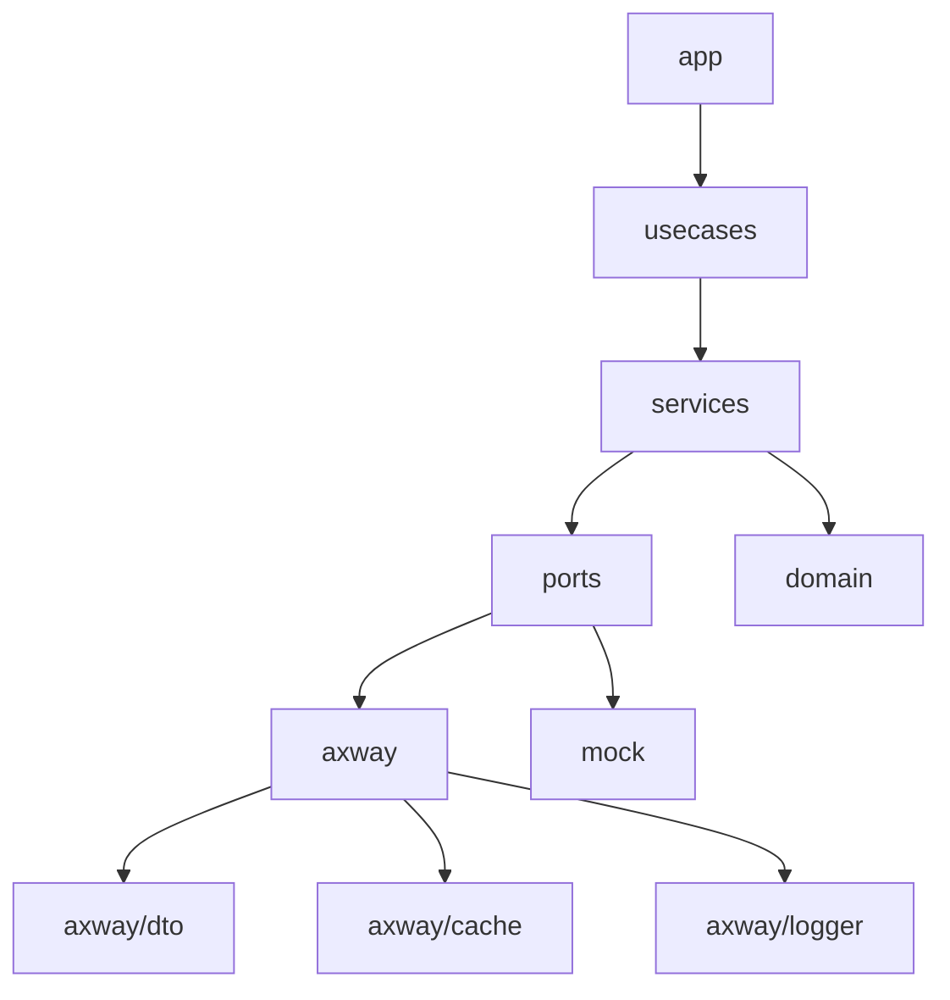
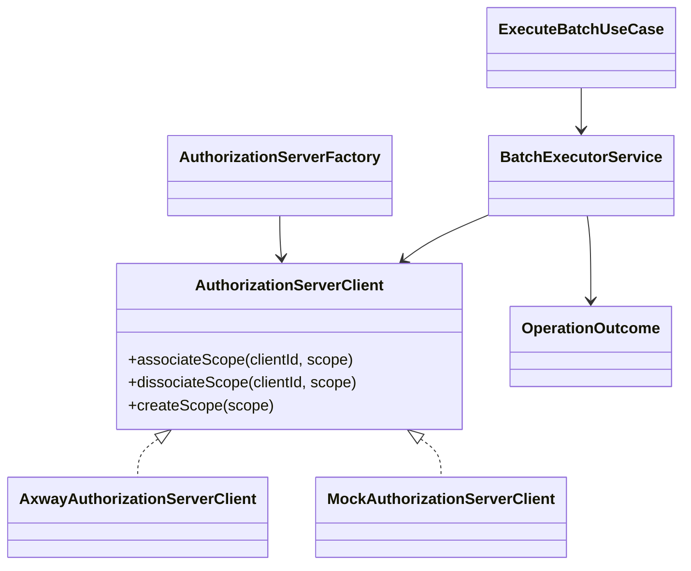

# 2. Arquitetura

[Anterior](overview.md) | [Índice](README.md) | [Próximo](configuration.md)

## Diagrama de Módulos

## Diagrama de Classes

## Camadas
- **app**: ponto de entrada e CLI (Picocli).
- **usecases**: orquestração principal do batch.
- **services**: regras de execução, paralelismo e auditoria.
- **ports**: contratos de integração (ex.: `AuthorizationServerClient`).
- **axway**: implementação concreta de AS (DTOs, cache, logger).
- **domain**: entidades e enums de status.

## Padrões aplicados
- **Strategy**: seleção de modo (`associate`/`dissociate`) em ponto único.
- **Factory**: criação de clientes de AS por nome (ex.: `axway`, `mock`).
- **DTOs**: mapeamento de payloads e respostas da Axway.

## Fluxo simplificado
1. CLI resolve entradas (clients/scopes, arquivos, flags).
2. Use case monta operações (NxN) e valida modo.
3. Batch executor distribui as operações em workers.
4. Cada operação chama o AS client (associar/desassociar).
5. Resultado é persistido em auditoria e em cache de retomada.
6. Relatório final consolida OK/FAIL/SKIP e tempos.

[Anterior](overview.md) | [Índice](README.md) | [Próximo](configuration.md)
