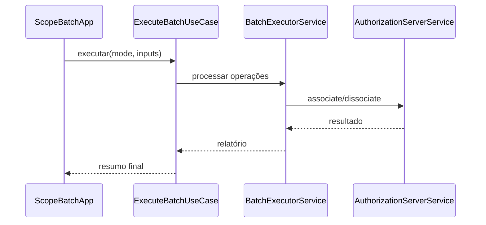

# 1. Visão Geral

[Anterior](README.md) | [Índice](README.md) | [Próximo](architecture.md)

## Diagrama de Fluxo

O **Scope Handler** é um batch em Java que gerencia associação e desassociação de escopos OAuth 2.0 para múltiplos clients em um Authorization Server (AS). Ele processa entradas em lote (NxN), pode usar multi-threading e produz logs de auditoria, relatórios consolidados e cache de retomada.

Principais objetivos:
- Operar em batch com grande volume.
- Ser resiliente: retomar execução sem repetir operações concluídas.
- Ser auditável: rastrear todas as operações e resultados.
- Ser extensível: suportar múltiplos AS via implementação concreta.

## Componentes principais
- **App (CLI)**: interpreta argumentos, resolve inputs, inicia o batch.
- **Use Cases**: orquestram a execução do batch.
- **Services**: implementam processamento concorrente, auditoria e relatórios.
- **Ports**: interface de `AuthorizationServerService` para abstrair integrações.
- **AS Clients**: implementações concretas (ex.: Mock, Axway).

[Anterior](README.md) | [Índice](README.md) | [Próximo](architecture.md)
